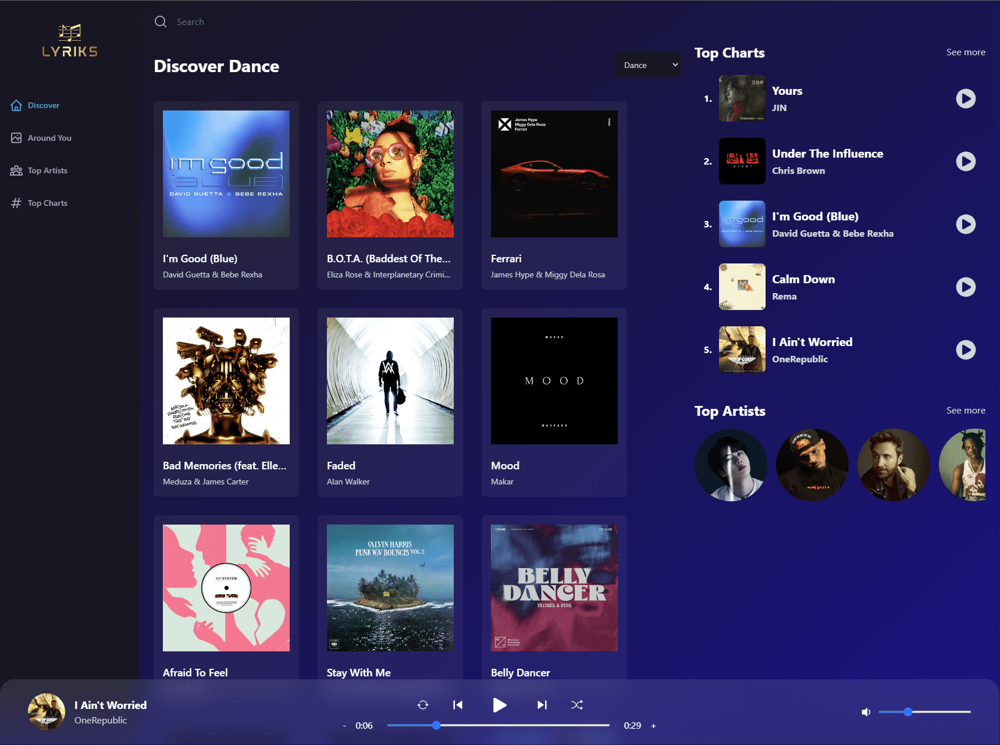

Lyriks Music App  
================  

[Live Website](https://utkarsh-lyriks.netlify.app/)  

Introducing the Lyriks music app, a groundbreaking platform that reshapes your music experience. Meticulously built with ReactJS, Redux Toolkit, TailwindCSS and the comprehensive Shazam Core API from Rapid API, this app redefines how you interact with music.  

At the core of the app's architecture lies ReactJS, which powers the frontend with its seamless interactivity and dynamic rendering. Redux Toolkit further enhances the user experience, facilitating efficient state management and seamless navigation between different sections of the app.  

TailwindCSS lends a touch of sophistication to the app's design, ensuring uniformity and responsiveness across diverse devices and screen sizes. Its utility-first approach expedites development, resulting in a polished and contemporary aesthetic.  

The integration of the Shazam Core API from Rapid API catapults the Lyriks app into a league of its own. This multifaceted API empowers the app with a wide range of features, enabling users to access top charts, explore songs by genre, dive into song details and related content, uncover artist information, discover music by country and conduct intricate song searches.  

From identifying trending tracks to immersing yourself in song details and artist insights, the Lyriks app seamlessly amalgamates advanced technologies. It leverages ReactJS, Redux Toolkit, TailwindCSS and a plethora of Shazam Core API functionalities to deliver a music-centric experience that sets a new standard. Immerse yourself in a world of music discovery and exploration like never before.  

